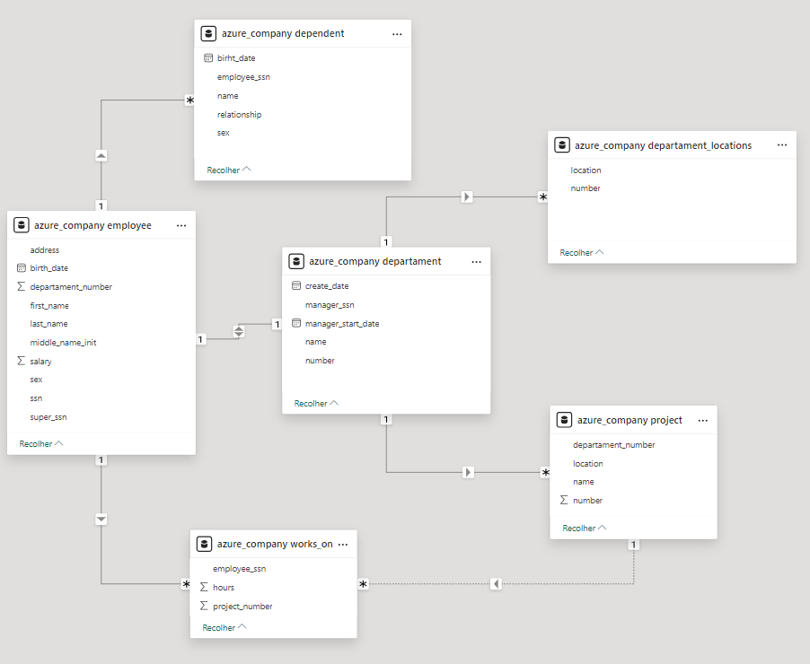
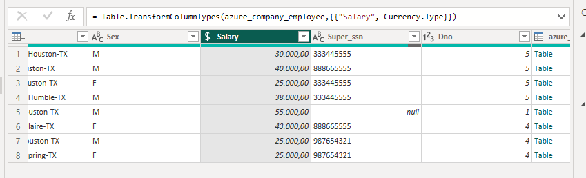
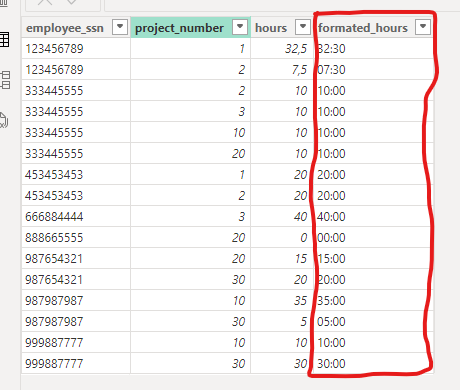
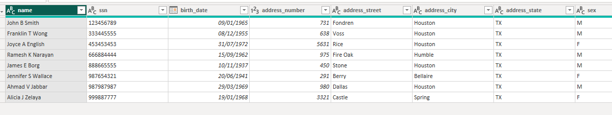
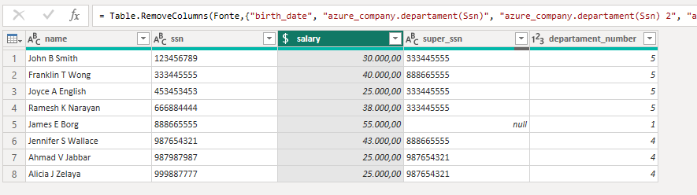
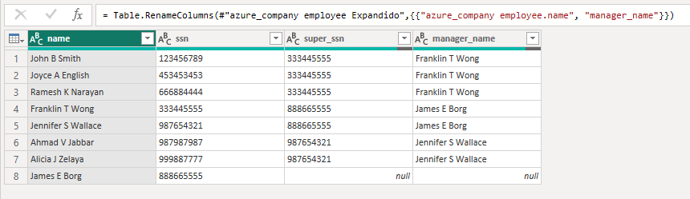
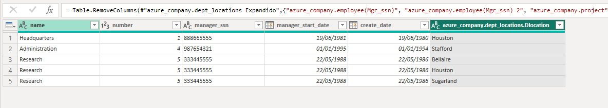
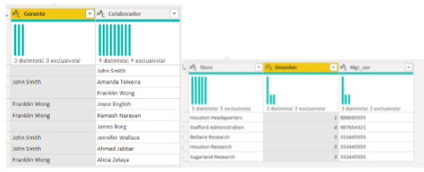
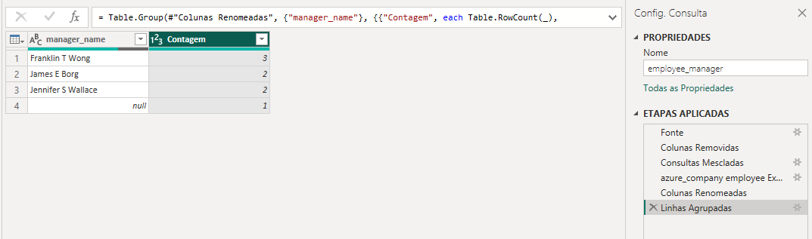

# power_bi_analyst módulo 3

## Processamento de Dados Simplificado com Power BI

1. Criação de uma instância na Azure para MySQL
- Server name: powerbi-dio.mysql.database.azure.com

2. Criar o Banco de dados com base disponível no github
- Data base: azure_company

3. Integração do Power BI com MySQL no Azure
- Conectado utilizando dados do banco

4. Verificar problemas na base a fim de realizar a transformação dos dados
- Tratamento dos dados através do Power Query

## Diretrizes para transformação dos dados

1. Verifique os cabeçalhos e tipos de dados
- sanitização dos nomes dos campos
    

2. Modifique os valores monetários para o tipo double precison
- 30000 => 30000,00
    

3. Verifique a existência dos nulos e analise a remoção
- Apenas James E Borg está nulo em Employee, não remover, pois é gerente Geral

4. Os employees com nulos em Super_ssn podem ser os gerentes. Verifique se há algum colaborador sem gerente
- Sim, James E Borg está nulo, o mesmo é gerente Geral

5. Verifique se há algum departamento sem gerente
- Todos os departamente possuem gerentes

6. Se houver departamento sem gerente, suponha que você possui os dados e preencha as lacunas
- Todos os departamente possuem gerentes

7. Verifique o número de horas dos projetos
- Todos os projetos tem horas, adicionamente criei uma nova coluna formatando para um formato de tempo sanitizado:
    

8. Separar colunas complexas
- Separado: Address em 4 novas colunas
- Nomes agrupados em apenas uma coluna, removendo as utilizadas na mesclagem
    

9. Mesclar consultas employee e departament para criar uma tabela employee com o nome dos departamentos associados aos colaboradores. A mescla terá como base a tabela employee. Fique atento, essa informação influencia no tipo de junção.
10. Neste processo elimine as colunas desnecessárias.
- Os dois passos(9, 10) foram feitos juntos
    

11. Realize a junção dos colaboradores e respectivos nomes dos gerentes. Isso pode ser feito com consulta SQL ou pela mescla de tabelas com Power BI. Caso utilize SQL, especifique no README a query utilizada no processo.
    

12. Mescle as colunas de Nome e Sobrenome para ter apenas uma coluna definindo os nomes dos colaboradores
- Feito no passo 8

13. Mescle os nomes de departamentos e localização. Isso fará que cada combinação departamento-local seja único. Isso irá auxiliar na criação do modelo estrela em um módulo futuro.
    

14. Explique por que, neste caso supracitado, podemos apenas utilizar o mesclar e não o atribuir.

- Mesclar (Merge): Utilizado quando você quer combinar colunas de duas tabelas em uma única tabela, com base em uma coluna comum. Ideal para juntar informações complementares.
- Atribuir (Append): Utilizado para adicionar linhas de uma tabela a outra. Essencialmente, você está empilhando uma tabela em cima da outra, útil quando as tabelas têm a mesma estrutura de colunas.

15. Agrupe os dados a fim de saber quantos colaboradores existem por gerente
    

16. Elimine as colunas desnecessárias, que não serão usadas no relatório, de cada tabela
- Dados limpos