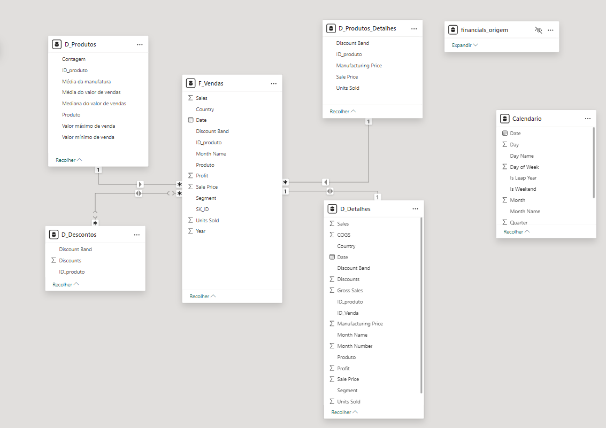

# power_bi_analyst módulo 4 - Star Schema coma base em apenas uma tabela

Criação das tabelas com base na tabela original(Financial Sample). A partir da cópia serão selecionadas as colunas que irão compor a visão da nova tabela. 

## Tabelas criadas
 - Financials_origem (modo oculto – apenas para backup)
 - D_Produtos
    - ID_produto
    - Produto
    - Contagem
    - Média da manufatura
    - Médias do valor de vendas
    - Mediana do valor de vendas
    - Valor máximo de Venda
    - Valor mínimo de Venda
 - D_Produtos_Detalhes
    - ID_produto
    - Discount Band
    - Units Sold
    - Manufactoring Price
    - Sale Price
 - D_Descontos
    - ID_produto
    - Discount Band
    - Discounts
 - D_Detalhes
    - Segment
    - Country
    - Produto
    - Discount Band
    - Units Sold
    - Manufacuring Price
    - Sale Price
    - Sales
    - COGS
    - Profit
    - Date
    - Month Number
    - Month Name
    - Year
    - Gross Sales
    - Discounts
    - ID_produto
    - ID_venda
 - D_Calendário
    - Date
    - Year
    - Quarter
    - Month
    - Month Name
    - Day
    - Day Name
    - Day of Week
    - Week of Month
    - Week of Year
    - Is Weekend
    - Is leap Year
 - F_Vendas
    - SK_ID
    - ID_Produto
    - Produto
    - Units Sold
    - Sales Price
    - Discount Band
    - Segment
    - Country
    - Sales
    - Profit
    - Date (campos)
    - Month Name
    - Year

## Versão final do Star Schema    
